[Русский](README.md) · **English**

<div align="center">

# ⚙️ Piston Engine 3D Simulator

**An interactive physics bench in the browser. The thermodynamics of the cycle are integrated
numerically, the mechanism is modelled in full — from the rings to the camshafts and the
turbo — and the sound is synthesised from the very combustion events you see on screen.**

[](https://grisha123invent-official.github.io/piston-engine-3d-simulator/)
[](https://threejs.org/)
[](#-running-locally)
[](LICENSE)

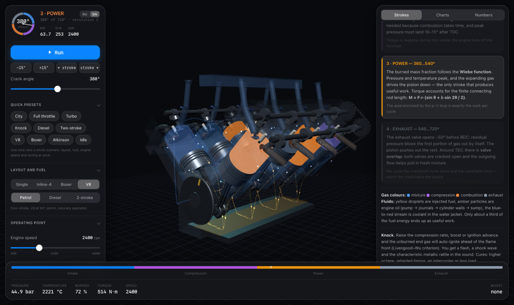

<sub>A 90° V8: eight cylinders, a firing event every 90°, total torque with almost no dips</sub>

</div>

---

## 🎯 What this is

A teaching-grade internal-combustion engine simulator in which **nothing is drawn by eye**.
Piston position comes from exact kinematics; pressure and temperature from numerical
integration of the cycle in 0.5° steps; crankshaft torque from resolving the forces in the
connecting rod; knock from the Livengood–Wu auto-ignition integral; and the exhaust note from
the same combustion events that are visible on screen.

Any parameter can be changed while the engine runs, and you immediately see what happened to
the p–V diagram, the power, the efficiency and the margin to knock.

Baseline engine: **86 × 86 mm, 0.5 L per cylinder** — a 0.5 L single, a 2.0 L inline-four,
a 4.0 L V8.

## ✨ What it does

| | |
|---|---|
| 🔧 **Three layouts** | Single-cylinder, inline-four with a 1–3–4–2 firing order, 90° V8 with a cross-plane crankshaft |
| 🔄 **Two- and four-stroke** | Four-stroke with camshafts, or two-stroke with ports in the cylinder wall and crankcase scavenging |
| ⛽ **Petrol and diesel** | Spark ignition, or compression ignition with a double Wiebe function |
| 🌀 **Boost** | Turbo with rotor inertia and a wastegate, intercooler, honest turbo lag |
| 🎵 **Sound synthesis** | Exhaust pulses, intake noise, compressor whistle, valve clatter and the metallic rattle of knock |
| 📈 **Seven charts** | p–V, torque, kinematics, valve timing, energy balance, full-load speed curve, balance |
| 💥 **Knock** | From the Livengood–Wu integral — with a shock wave in the chamber and an audible rattle |
| 🎚 **Live tuning** | Engine speed, throttle, compression ratio, ignition advance, octane number, intake tract length |
| 🌍 **Two languages** | Russian and English — switched on the fly, including the theory, the charts and the part labels |
| 🧭 **Engine operating map** | A heat map of fuel consumption across speed and load, with contour lines, a knock zone and an "island of efficiency" |
| ⚗️ **Cycles and mixture formation** | Atkinson cycle, direct injection, variable-length intake, balance shafts |
| 💧 **Every fluid** | Fuel, exhaust, oil circuit, coolant in the jacket, boost flow, loop scavenging |
| ⚡ **Quick presets** | Eight scenarios in one click: City, Full throttle, Turbo, Knock, Diesel, Two-stroke, V8, Idle |

<div align="center">
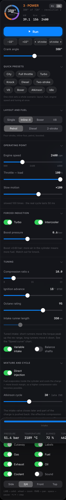
</div>

## 🎛 The interface

The panels are built as frosted glass: heavy background blur, a hairline light border and
a soft shadow — the engine shows through them and stays the centre of attention.
Typography and controls are system-native: segmented pickers, toggles and sliders behave
the way they do in macOS and iOS.

The header carries a circular crank-angle dial with a sector per stroke and live power,
torque and speed readouts. Quick presets set up an entire scenario in one click; everything
else lives in collapsible sections.

Controls: left mouse button orbits the camera, wheel zooms, right button pans, space pauses,
arrow keys step through the cycle (hold Shift for 45° steps).

<br clear="right">

### 📱 On a phone

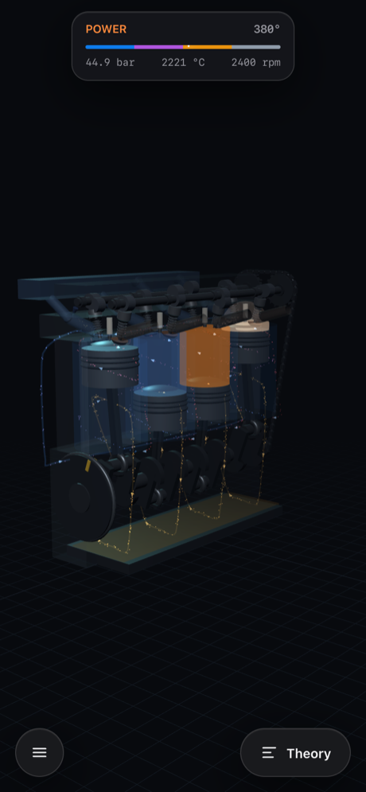
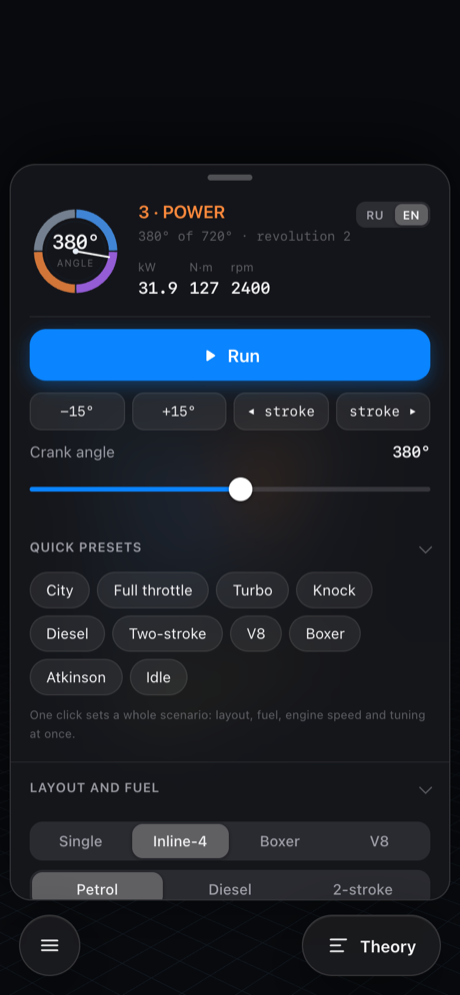

The whole screen belongs to the 3D model: panels are hidden, part labels are off and the
camera pulls back to fit a portrait screen. Controls and theory slide up as sheets —
the burger on the left, "Theory" on the right. Tapping the scene dismisses the sheet,
and the cycle strip steps aside for it.

## 🔄 The four strokes

| | |
|---|---|
| 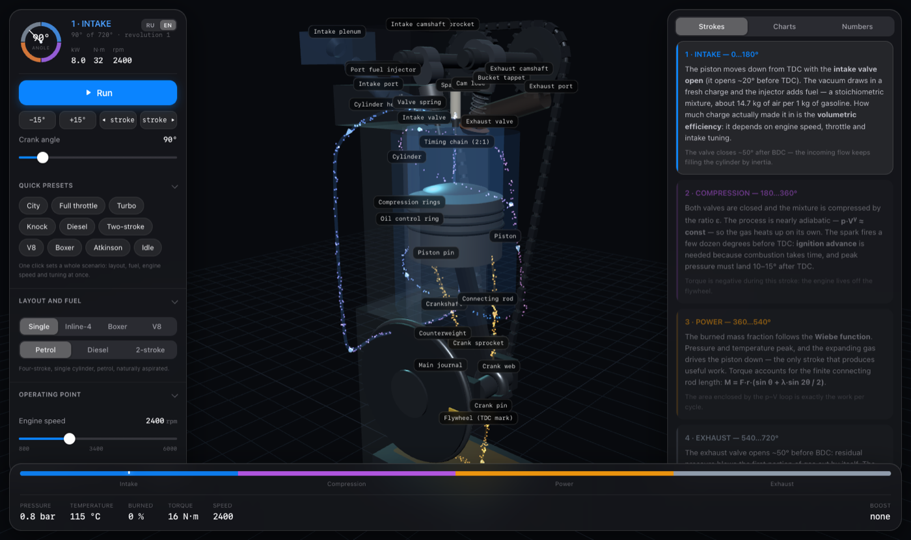 | **1 · Intake (0…180°).** The piston travels down with the intake valve already open 20° before TDC. Pressure falls to 0.9 bar and the injector delivers fuel. How much charge actually made it in is given by the volumetric efficiency, which depends on engine speed, throttle and intake tract tuning. |
| 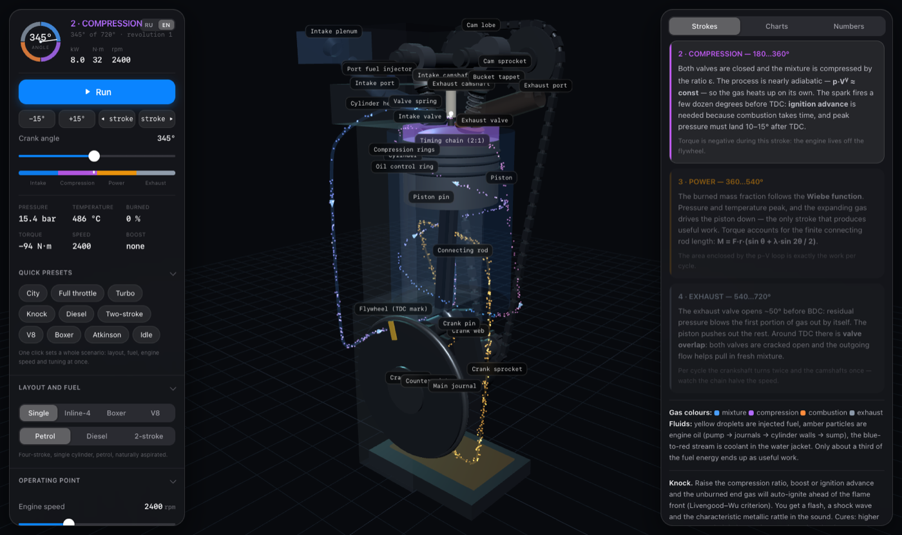 | **2 · Compression (180…360°).** Valves closed, the mixture is squeezed by a factor of ε and heats itself: by 340° it is already at 14.5 bar and 450 °C. The spark jumps 18° before TDC — combustion takes time, and peak pressure should land 10–15° after TDC. |
| 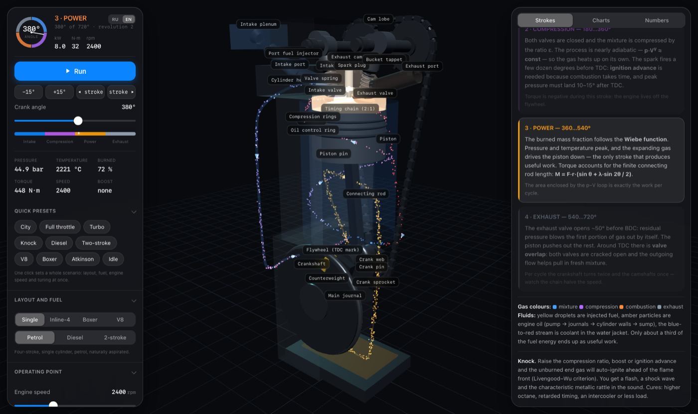 | **3 · Power (360…540°).** The burned mass fraction follows a Wiebe function; pressure reaches 51 bar and temperature 2444 °C. The only stroke that does useful work. |
| 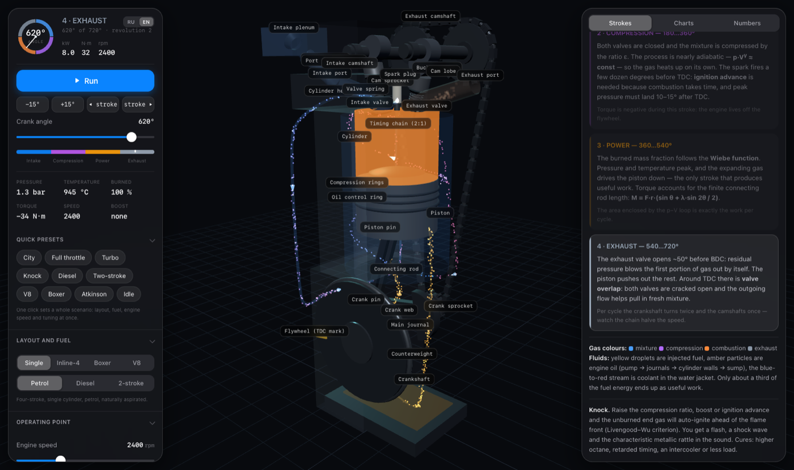 | **4 · Exhaust (540…720°).** The exhaust valve opens 50° before BDC — the residual 5 bar blow the first slug of gas out on their own. Around TDC the valves overlap. |

Crankshaft torque is computed exactly, accounting for the finite length of the connecting rod:

```
M = F·r·( sin θ + λ·sin 2θ / (2·√(1 − λ²·sin²θ)) ),   λ = r/L ≈ 0.3
```

## 🌀 Boost

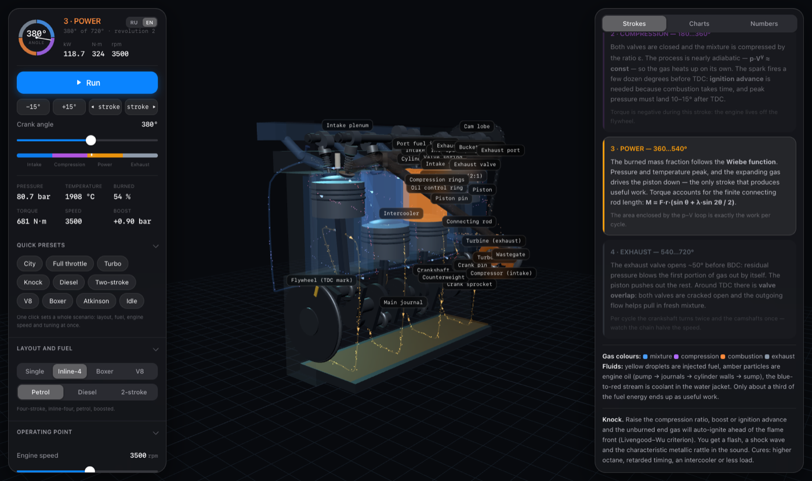

Exhaust gas spins the turbine, the compressor pushes air, the intercooler cools it down —
all of it visible in 3D and all of it feeding into the calculation:

| Mode | Power | Charge temperature | Knock |
|---|---|---|---|
| Naturally aspirated | 49.0 kW | 300 K | none (0.58) |
| 0.8 bar boost **with intercooler** | **87.4 kW** (×1.79) | 325 K | on the edge |
| 0.8 bar boost **without intercooler** | 68.8 kW (×1.41) | 376 K | earlier and harder |

The intercooler is not decoration here: it takes 50 degrees out of the charge, and that is
exactly why it lets you hold more boost without knock.

**Turbo lag** is modelled through rotor inertia: at 1500 rpm the boost reaches 90 % of its
plateau in 0.87 seconds — switch to the "Turbo" preset and watch the gauges right after the
launch.

## 🎼 Tuned intake

Volumetric efficiency is not read off a fitted curve — it comes from the resonance of the air
column in the intake tract: `f = c/(4L)`. Runner length therefore genuinely moves the torque
peak, and the runners in the 3D scene change length along with the slider:

| Tract length | Torque peak |
|---|---|
| 200 mm | 138 N·m at **5600 rpm** |
| 400 mm | 179 N·m at **3200 rpm** |
| 700 mm | 159 N·m at **1850 rpm** |

Short tract for the top end, long tract for the bottom end. Exactly the trade-off that
variable-length intake manifolds exist to win.

## 🔩 Layouts and balance

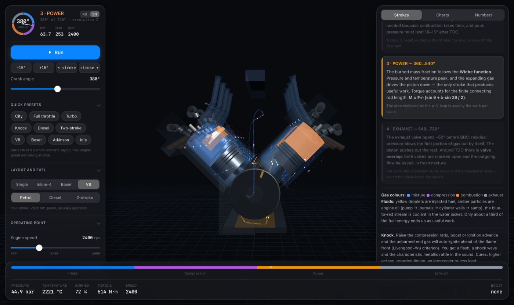

| Layout | 1st order | 2nd order | What it means |
|---|---|---|---|
| Single-cylinder | **2334 N** | 718 N | The first-order force has nothing to cancel it — hence the characteristic shake |
| Inline-four | 0 N | **2874 N** | First order cancels out, but the second orders add up — the classic I4 vibration |
| V8, 90° bank angle | 0 N | 0 N | Both orders are balanced; what remains is a longitudinal couple and uneven exhaust timing — that burbling sound |

Model check: theory gives `m·ω²·r = 2334 N` for a single cylinder and `4·λ·m·ω²·r = 2808 N`
for the second order of the four — the calculation agrees.

## ⚡ The two-stroke cycle

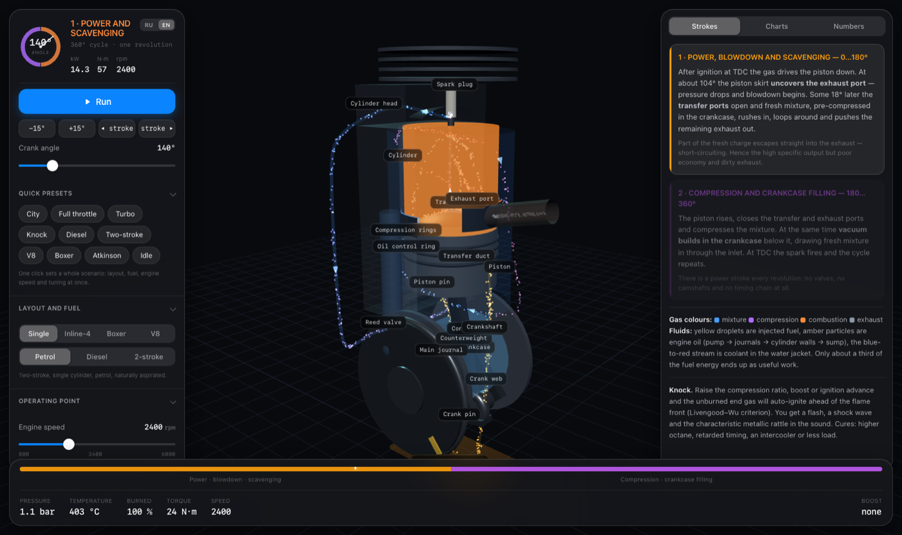

No valves, no camshafts, no timing chain: the piston skirt uncovers the exhaust port at 104°
and the transfer ports at 122°, while fresh mixture arrives from the crankcase and turns over
in a Schnürle loop. Part of the mixture goes straight out of the exhaust — that is
**short-circuiting** of the scavenging flow, 26 % in the model.

Hence the honest trade-off (same displacement, same engine speed):

| | Power per litre | Efficiency | BSFC |
|---|---|---|---|
| Four-stroke | 23.7 kW/L | 32.0 % | 256 g/(kW·h) |
| Two-stroke | **35.6 kW/L** (×1.5) | **22.6 %** | 362 g/(kW·h) |

## 💥 Knock

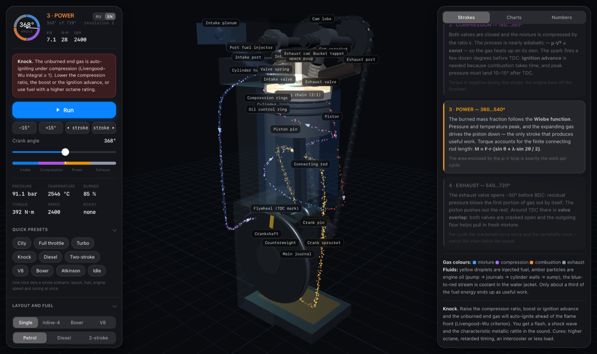

```
τ = 17.68 · (ON/100)^3.402 · p^(−1.7) · exp(3800/T),   knock when ∫dt/τ ≥ 1
```

The integral is taken over the unburned end gas, so the margin behaves the way it does in
real life:

| Mode | Integral | Knock |
|---|---|---|
| ε = 8, RON 95, 18° advance | 0.36 | no |
| ε = 10, RON 95, 18° advance | 0.61 | no |
| ε = 12, RON 95, 18° advance | 0.94 | no, but on the edge |
| ε = 10, **RON 80**, 18° advance | 1.10 | **yes** |
| ε = 12, RON 95, 30° advance | 1.31 | **yes** |
| ε = 14, RON 92, 35° advance | 2.19 | **yes, heavy** |
| ε = 12, 30° advance, 30 % throttle | 0.50 | no — safe at part load |

The cure is the same as in a real engine: higher-octane fuel, retarded ignition, an
intercooler, or less load. And you can hear it — as that characteristic metallic rattle.

## 📈 Charts

<table>
<tr>
<td width="50%">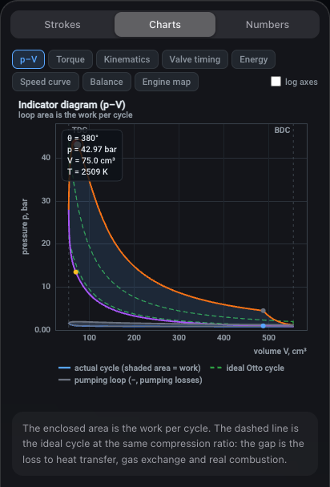</td>
<td width="50%">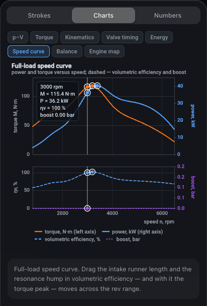</td>
</tr>
<tr>
<td><b>Indicator p–V diagram.</b> The area of the loop is the work per cycle; the dashed line
is the ideal cycle at the same compression ratio. Under boost the gas-exchange loop turns
positive, and the chart labels that directly.</td>
<td><b>Full-load speed curve.</b> Power and torque against engine speed, plus volumetric
efficiency and boost. This is where the resonance hump shows up, travelling with the length of
the intake tract.</td>
</tr>
<tr>
<td>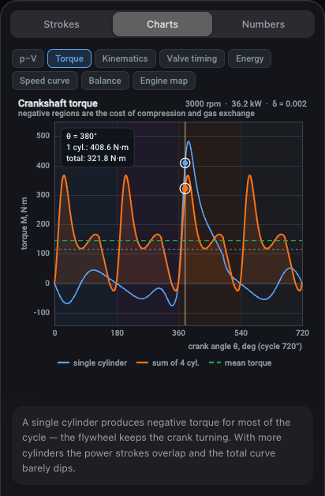</td>
<td>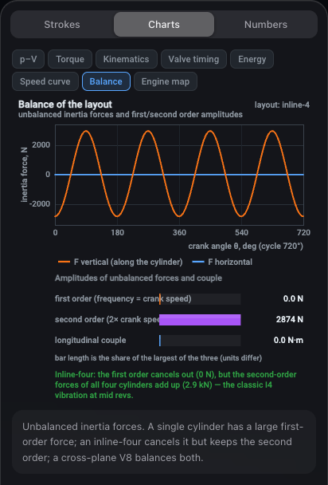</td>
</tr>
<tr>
<td><b>Crankshaft torque.</b> On a single cylinder it is negative for most of the cycle — the
flywheel is driving the crank. On a multi-cylinder engine the power strokes overlap and the
dips disappear.</td>
<td><b>Balance.</b> Unbalanced inertia forces against crank angle, plus the first- and
second-order amplitudes for the current layout.</td>
</tr>
<tr>
<td>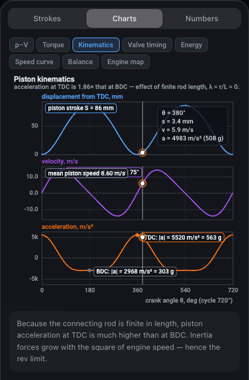</td>
<td>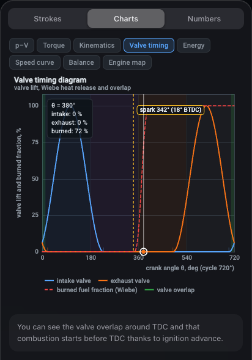</td>
</tr>
<tr>
<td><b>Piston kinematics.</b> Acceleration at TDC is <b>360 g</b> against <b>194 g</b> at
BDC — exactly the ratio (1+λ)/(1−λ). Inertia forces grow with the square of engine speed.</td>
<td><b>Valve timing.</b> Valve lift (or port opening on the two-stroke), the overlap region
and the Wiebe heat-release curve.</td>
</tr>
</table>

<div align="center">
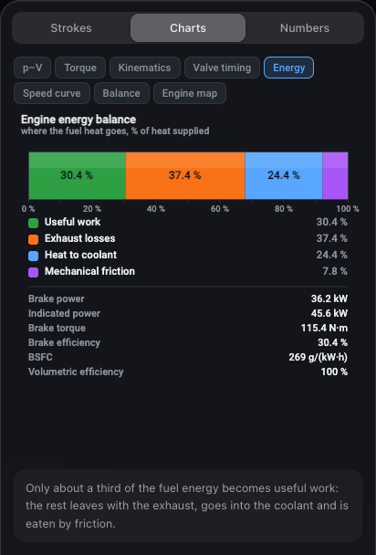
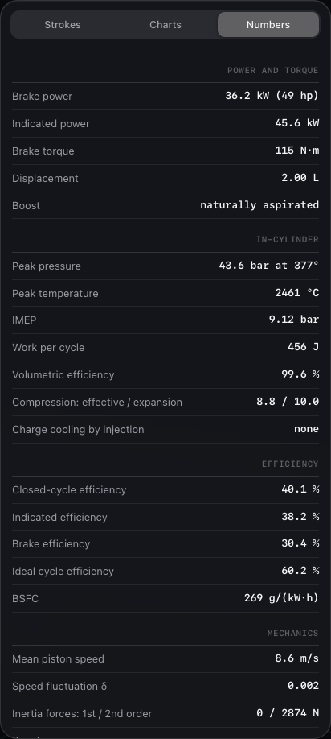
</div>

## ⚗️ Atkinson cycle and direct injection

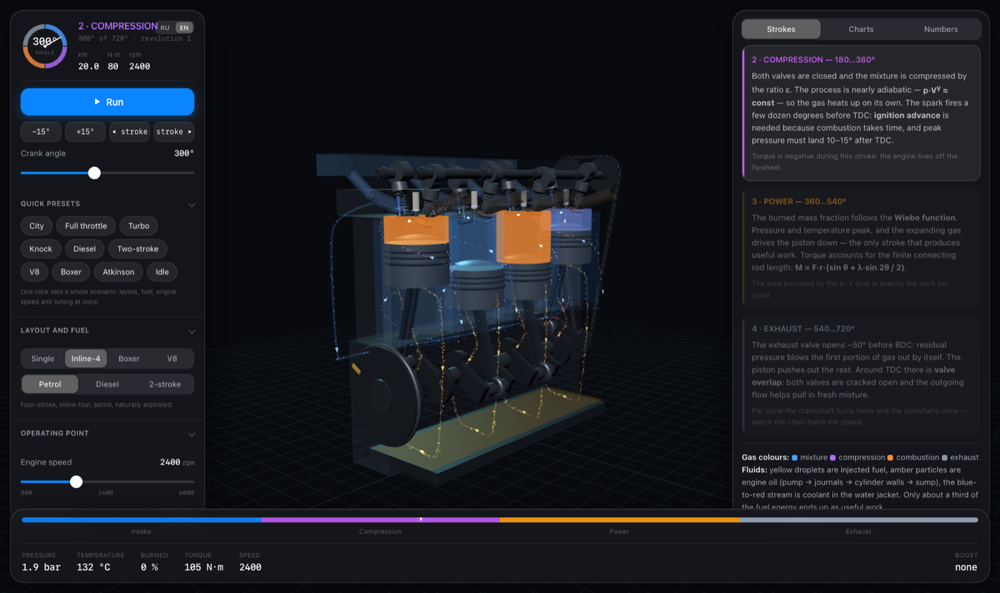

The **Atkinson cycle** closes the intake valve later, so part of the charge is pushed back into
the intake manifold. The effective compression ratio drops while the expansion ratio stays
geometric — the gases get to give up more work:

| Late intake closing | effective ε | Blown back | Closed-cycle efficiency | Power |
|---|---|---|---|---|
| 0° | 8.8 | 0 % | 40.4 % | 49.0 kW |
| 30° | 7.0 | 24 % | 41.4 % | 34.5 kW |
| 60° | 4.6 | 54 % | **43.2 %** | 15.0 kW |

At a fixed throttle the brake efficiency actually falls — friction and the pumping stroke do
not shrink along with the charge. The gain appears **at equal power**: at 2000 rpm an Atkinson
engine with 30° of late closing returns a BSFC of 284 against 289 g/(kW·h) for the ordinary
cycle throttled down to the same power. Knock retreats too: the integral drops from 0.58 to
0.29, so the geometric compression ratio can be raised.

**Direct injection** evaporates the fuel inside the cylinder and cools the charge by 23.7 K.
Volumetric efficiency rises from 90.9 to 93.8 %, power from 49.0 to 56.6 kW, and the highest
compression ratio free of knock climbs from **12.5 to 13.7**.

## 🔩 The boxer four and balance shafts

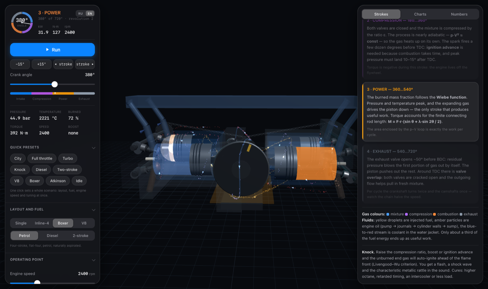

Opposing pistons travel towards each other, and each one has **its own crankpin, offset by
180°**: that is exactly what separates a boxer from a 180° V engine. The firing order is
1–3–2–4.

| Layout | 1st order | 2nd order | Longitudinal couple |
|---|---|---|---|
| Inline-four | 0 N | 2874 N | 0 |
| **Flat-four** | **0 N** | **0 N** | 74 N·m |
| V8 90° | 0 N | 0 N | 886 N·m |

**Balance shafts** damp what is left: on the single cylinder the first order falls from 2334 to
350 N, and on the inline-four the second order from 2874 to 431 N (Lanchester shafts, spinning
at twice crankshaft speed). They can never cancel it completely — the residual 15 % is visible
on the chart.

## 🧭 Engine operating map

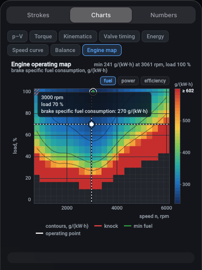

A 24×16 grid over the speed × load axes is computed in 0.4 seconds and shows where the engine
is economical and where it is not. The contour lines are BSFC, the red hatching is the knock
zone, the ring is the "island of efficiency" (242 g/(kW·h) at 3513 rpm) and the crosshair is
the current operating point. It switches between fuel consumption, power and efficiency.

This map is exactly where you can see why fuel consumption is several times worse at low load:
useful work falls off faster than friction and pumping losses.

<br clear="right">

## 🌍 Two languages


The **RU / EN** switch in the console header changes the language of everything on the fly — the
panel, the theory, all eight charts and the part labels in 3D. Your choice is remembered, and
the `?lang=en` link opens the simulator in English straight away.

## 🧪 Inside the model

**Kinematics.** `y(θ) = r·cos θ + √(L² − (r·sin θ)²)`, r = 43 mm, L = 143 mm.

**Thermodynamics.** A single-zone model, integrated over crank angle in 0.5° steps with four
sub-steps:

```
dT/dθ = [ dQ_comb/dθ − dQ_wall/dθ − p·dV/dθ ] / (m·cv),   p = m·R·T/V
```

- heat release — a Wiebe function, doubled for the diesel (a fast premixed phase plus a long diffusion phase);
- the ratio of specific heats γ(T) runs from 1.40 down to 1.255 — it is not a constant;
- wall heat transfer — the Woschni correlation, with area growing as the piston travels;
- exhaust — outflow as `dp/dθ = −(p − p_exh)/τ − γ·p·dV/V`;
- residual gas converges within two passes through the cycle;
- friction — an empirical FMEP, which is where indicated and brake power part ways.

**Dynamics.** Rotation is integrated through the flywheel's moment of inertia:
`J·ω·dω/dθ = M(θ) − M_load`. At a nominal 1200 rpm the single cylinder swings between
984 and 1277 rpm; the inline-four stays within 1199…1235.

**Sound.** Synthesised with Web Audio: exhaust pulses through a resonant filter, intake noise,
compressor whistle, valve clatter and a narrow-band knock rattle. The firing frequency is
divided by the slow-motion factor, so in slow motion you hear individual combustion events in
sync with the picture, while at ×1 they merge into a steady rumble.

**Verification.** The physics core has been run across 9600 configurations without a single
NaN; a full recompute of the cycle takes 1.2 ms and a speed sweep 90 ms. The 3D mechanism is
covered by 392 assertions (the connecting rod sits exactly on the crankpin for every layout,
the camshafts turn at exactly 2:1, the ports are uncovered by the piston skirt), and the audio
by measurements of firing frequency, absence of node leaks and absence of clipping.

## 🎮 URL parameters

```
?deg=380        starting crank angle
&layout=v8      layout: single | i4 | v8
&stroke=2       two-stroke cycle
&fuel=diesel    diesel mode
&boost=0.9      boost pressure, bar
&turbo=1        turbo with rotor inertia (otherwise boost is instant)
&intercooler=0  disable the intercooler
&intakeLen=700  intake tract length, mm
&rpm=3500       engine speed
&throttle=0.4   throttle
&eps=12         compression ratio
&adv=25         ignition advance
&octane=92      octane number
&atkinson=45    late intake closing (Atkinson cycle), degrees
&di=1           direct injection
&varIntake=1    variable-length intake
&shafts=1       balance shafts
&lang=en        interface language: ru | en
&cam=side       camera: side | iso | front | top
&pause=1        open paused
&ui=0           hide the panels, &still=1 — a single frame
```

Examples: [V8](https://grisha123invent-official.github.io/piston-engine-3d-simulator/?layout=v8&deg=380&pause=1) ·
[turbo](https://grisha123invent-official.github.io/piston-engine-3d-simulator/?layout=i4&boost=0.9&turbo=1&eps=9&adv=12&octane=98&rpm=3500) ·
[two-stroke](https://grisha123invent-official.github.io/piston-engine-3d-simulator/?stroke=2&deg=140&pause=1) ·
[knock](https://grisha123invent-official.github.io/piston-engine-3d-simulator/?eps=14&adv=35&octane=92&deg=368&pause=1) ·
[diesel](https://grisha123invent-official.github.io/piston-engine-3d-simulator/?fuel=diesel&eps=18&deg=372&pause=1)

## 🚀 Running locally

No build step is required, but you do need an HTTP server — the page is made of ES modules:

```bash
git clone https://github.com/grisha123invent-official/piston-engine-3d-simulator.git
```

```bash
cd piston-engine-3d-simulator && python3 -m http.server 8000
```

Open <http://localhost:8000>. Three.js ships with the repository (`vendor/`), so no internet access is needed.

## 📁 Structure

```
piston-engine-3d-simulator/
├── index.html          ← console markup and styles
├── src/
│   ├── physics.js      ← thermodynamics, boost, resonance, knock, forces, balancing
│   ├── engine3d.js     ← mechanism: pistons, crankshaft, camshafts, turbo, two-stroke ports
│   ├── fluids3d.js     ← gases, injection, exhaust, oil, cooling, boost, scavenging
│   ├── charts.js       ← the seven canvas charts
│   ├── sound.js        ← engine sound synthesis on Web Audio
│   ├── layout.js       ← layouts and overall scene dimensions
│   ├── i18n.js         ← language switching (Russian / English)
│   ├── content.js      ← theory and hint texts in both languages
│   └── main.js         ← scene, animation loop, interface
└── docs/               ← screenshots for this README
```

## 💡 Possible next steps

- [ ] Cylinder deactivation at low load
- [ ] Exhaust gas recirculation and its effect on knock
- [ ] Cam phasers with continuously variable valve timing
- [ ] Emissions modelling: CO, NOx and soot across the operating range
- [ ] A free-piston and a rotary engine for comparison

## 📄 License

[MIT](LICENSE) — use it freely, including in physics classes.
