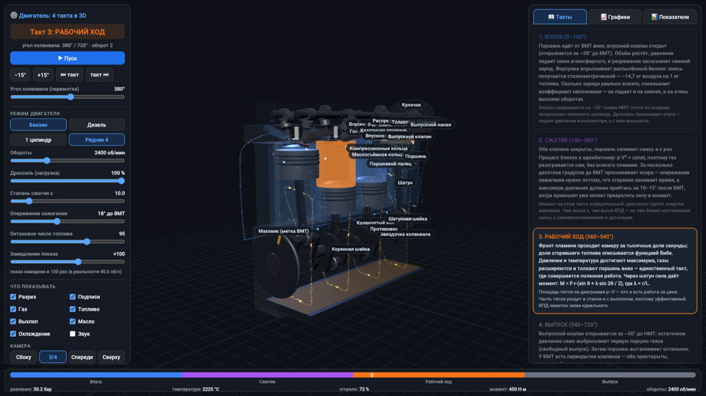
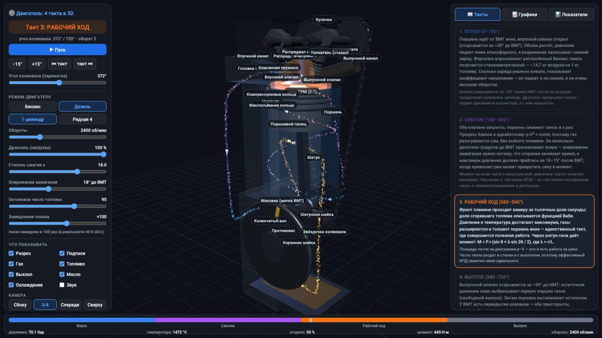

<div align="center">

# ⚙️ Симулятор работы поршня — 3D-модель четырёхтактного двигателя

**Интерактивный физический стенд в браузере: настоящая термодинамика цикла, кинематика
кривошипно-шатунного механизма, распредвалы, впрыск, детонация и диаграмма p–V —
всё считается на лету и показывается в 3D.**

[](https://grisha123invent-official.github.io/piston-engine-3d-simulator/)
[](https://threejs.org/)
[](#-запуск-локально)
[](LICENSE)


<sub>Рабочий ход: смесь горит, 50 бар и 2225 °C, сгорело 72 % топлива, момент на валу 506 Н·м</sub>

</div>

---

## 🎯 Что это

Учебный симулятор двигателя внутреннего сгорания, в котором **ничего не нарисовано «на глаз»**.
Положение поршня берётся из точной кинематики, давление и температура — из численного
интегрирования термодинамического цикла, момент на валу — из разложения сил в шатуне,
а детонация — из критерия самовоспламенения Ливенгуда–Ву. Любой параметр можно менять
на ходу и сразу видеть, что произошло с диаграммой p–V, мощностью и КПД.

Модель двигателя: **86 × 86 мм, 0,5 л на цилиндр** (рядная четвёрка — 2,0 л), степень сжатия
регулируется от 8 до 22, обороты — от 800 до 6000 об/мин.

## ✨ Возможности

| | |
|---|---|
| 🧊 **Полный механизм в 3D** | Поршень с кольцами и пальцем, шатун, коленвал с щеками и противовесами, маховик, **два распредвала с кулачками**, толкатели, клапаны с пружинами, цепь ГРМ с передаточным отношением 2:1 |
| 🔥 **Настоящая термодинамика** | Однозонная модель: интегрирование по углу с шагом 0,5°, функция Вибе, теплоотдача в стенки по Вошни, свободный выпуск и наполнение |
| 💥 **Детонация** | Критерий Ливенгуда–Ву: подними ε или опережение, поставь 80-й бензин — и получишь стук с ударной волной в камере |
| 📈 **Пять научных графиков** | Индикаторная диаграмма p–V, момент на валу, кинематика поршня, фазы газораспределения, энергетический баланс |
| 🛠 **Регулируется на лету** | Обороты, дроссель, степень сжатия, опережение зажигания, октановое число, бензин/дизель, 1 или 4 цилиндра |
| ⚖️ **Маховик и неравномерность** | Вращение интегрируется через момент инерции: у одноцилиндрового обороты «гуляют» в цикле, у четвёрки — почти нет |
| 💧 **Все жидкости** | Впрыск топлива, выхлопные газы, замкнутый контур масла (насос → шейки → стенки → поддон), поток антифриза в рубашке с градиентом температуры |
| 📊 **Приборы** | Мощность в кВт и л.с., момент, IMEP, КПД индикаторный/эффективный/идеальный, удельный расход, коэффициент наполнения |
| 🎥 **4 ракурса + разрез** | Свободная камера, разрез блока, отключаемые подписи деталей и каждая жидкость отдельно |
| ⤓ **Экспорт CSV** | Все 18 массивов цикла (1441 точка) — для лабораторной работы или своих графиков |

## 🔄 Четыре такта

### 1️⃣ Впуск — 0…180°


Поршень идёт от ВМТ вниз, впускной клапан открыт (он открывается ещё за 20° до ВМТ).
Давление в цилиндре падает до **0,9 бар**, свежий заряд засасывается, форсунка впрыскивает
бензин — смесь стехиометрическая, ~14,7 кг воздуха на 1 кг топлива. Сколько заряда реально
поместилось, показывает **коэффициент наполнения** (в модели ~87 % на середине диапазона оборотов).
Клапан закрывается на 50° позже НМТ: поток по инерции продолжает наполнять цилиндр.

### 2️⃣ Сжатие — 180…360°


Оба клапана закрыты, смесь сжимается в ε раз. Процесс близок к адиабатному, поэтому газ
разогревается сам: к 340° уже **14,5 бар и 450 °C**. За 18° до ВМТ проскакивает искра —
опережение нужно потому, что сгорание занимает время, а максимум давления должен прийтись
на 10–15° после ВМТ. Момент на этом такте отрицательный: двигатель живёт за счёт маховика.

### 3️⃣ Рабочий ход — 360…540°


Доля сгоревшего топлива описывается функцией Вибе; давление доходит до **51 бар**,
температура — до **2444 °C**. Газы толкают поршень вниз — это единственный такт, где
совершается полезная работа. Момент считается точно, с учётом конечной длины шатуна:

```
M = F·r·( sin θ + λ·sin 2θ / (2·√(1 − λ²·sin²θ)) ),   λ = r/L ≈ 0,3
```

### 4️⃣ Выпуск — 540…720°


Выпускной клапан открывается за 50° до НМТ — остаточные 5 бар сами выбрасывают первую порцию
газов (свободный выпуск), дальше поршень выталкивает остальное при ~1,2 бар и 900 °C.
У ВМТ наступает **перекрытие клапанов**: оба приоткрыты, и уходящий поток помогает затянуть
свежую смесь.

## 📈 Графики

<table>
<tr>
<td width="50%"></td>
<td width="50%"></td>
</tr>
<tr>
<td><b>Индикаторная диаграмма p–V.</b> Площадь замкнутой петли — работа за цикл. Пунктиром
идеальный цикл Отто при той же степени сжатия: разница между кривыми и есть потери
на теплоотдачу, газообмен и реальное сгорание.</td>
<td><b>Момент на валу.</b> У одного цилиндра он большую часть цикла отрицательный — вал крутит
маховик. У рядной четвёрки рабочие ходы перекрываются, и суммарная кривая почти не проваливается.</td>
</tr>
<tr>
<td></td>
<td></td>
</tr>
<tr>
<td><b>Кинематика поршня.</b> Из-за конечной длины шатуна движение несимметрично: ускорение
у ВМТ <b>360 g</b> против <b>194 g</b> у НМТ — ровно отношение (1+λ)/(1−λ). Инерционные силы
растут как квадрат оборотов, отсюда и предел по оборотам.</td>
<td><b>Фазы газораспределения.</b> Подъём обоих клапанов, зона перекрытия у ВМТ и кривая
тепловыделения Вибе, которая начинается ещё до ВМТ — за счёт опережения зажигания.</td>
</tr>
</table>

<div align="center">


</div>

**Энергетический баланс** объясняет, почему двигатель греется: в полезную работу уходит около
трети энергии топлива, остальное забирают выхлоп, система охлаждения и трение.

## 💥 Детонация


Модель считает интеграл Ливенгуда–Ву по несгоревшей части смеси с реальной корреляцией
задержки самовоспламенения:

```
τ = 17,68 · (ON/100)^3,402 · p^(−1,7) · exp(3800/T),   детонация при ∫dt/τ ≥ 1
```

Поэтому запас до детонации ведёт себя как в жизни:

| Режим | Интеграл | Детонация |
|---|---|---|
| ε = 8, 95-й, опережение 18° | 0,36 | нет |
| ε = 10, 95-й, опережение 18° | 0,61 | нет |
| ε = 12, 95-й, опережение 18° | 0,94 | нет, но на грани |
| ε = 10, **80-й**, опережение 18° | 1,10 | **есть** |
| ε = 12, 95-й, опережение 30° | 1,31 | **есть** |
| ε = 14, 92-й, опережение 35° | 2,19 | **есть, сильная** |
| ε = 12, опережение 30°, дроссель 30 % | 0,50 | нет — на частичной нагрузке безопасно |

Помогает ровно то же, что и в реальном моторе: высокооктановое топливо, позднее зажигание,
меньшая нагрузка.

## 🔩 Рядная четвёрка и дизель



Порядок работы **1–3–4–2**: цилиндры 1 и 4 идут вверх, пока 2 и 3 идут вниз, рабочие ходы
чередуются через 180°. Коэффициент неравномерности хода падает с **0,08** у одноцилиндрового
до **0,007** у четвёрки — маховику почти нечего сглаживать.



В дизельном режиме нет свечи и дросселя: воздух сжимается в 18 раз, топливо впрыскивается прямо
в камеру у ВМТ, тепловыделение описывается **двойной функцией Вибе** (быстрая premixed-фаза
плюс длинная диффузионная). Давление доходит до 70–77 бар, температура ниже бензиновой
за счёт избытка воздуха, а индикаторный КПД выше: **0,42 против 0,39**.

## 🧪 Что внутри модели

**Кинематика.** `y(θ) = r·cos θ + √(L² − (r·sin θ)²)`, r = 43 мм, L = 143 мм.

**Термодинамика.** Однозонная модель, интегрирование по углу 0,5° с четырьмя подшагами:

```
dT/dθ = [ dQ_сгор/dθ − dQ_стенки/dθ − p·dV/dθ ] / (m·cv),   p = m·R·T/V
```

- тепловыделение — функция Вибе `xb = 1 − exp(−a·((θ−θ_нач)/Δθ)^(m+1))`, a = 5, m = 2;
- показатель адиабаты γ(T) от 1,40 до 1,255 — не константа;
- теплоотдача в стенки — упрощённая корреляция Вошни, площадь растёт вместе с ходом поршня;
- выпуск — истечение `dp/dθ = −(p − p_вып)/τ − γ·p·dV/V`;
- остаточные газы сходятся за два прохода по циклу;
- трение — эмпирическая FMEP, отсюда разница между индикаторной и эффективной мощностью.

**Динамика.** Вращение вала интегрируется через момент инерции маховика:
`J·ω·dω/dθ = M(θ) − M_нагр`, поэтому мгновенные обороты внутри цикла реально колеблются
(при 1200 об/мин одноцилиндровый гуляет в диапазоне 984…1277 об/мин, четвёрка — 1199…1235).

**Проверка.** Ядро прогнано на 8840 конфигурациях (бензин/дизель × 1/4 цилиндра × ε 8…22 ×
800…6000 об/мин × дроссель × опережение × октан) — ни одного NaN; полный пересчёт цикла
занимает ≈1 мс.

## 🎮 Управление

| Действие | Как |
|---|---|
| Вращать камеру / зум / сдвиг | ЛКМ · колесо · ПКМ |
| Пауза / пуск | Кнопка **⏸** или **Пробел** |
| Шаг по циклу | Кнопки ±15° или **←** / **→** (с Shift — по 45°) |
| Перейти к такту | «⏮ такт» / «такт ⏭» или клик по шкале внизу |
| Замедление показа | ×1 … ×2000 — при 2400 об/мин реальный цикл длится 50 мс |

### Параметры URL

```
?deg=380      стартовый угол коленвала (0…719)
&rpm=3000     обороты
&throttle=0.4 дроссель (0.05…1)
&eps=12       степень сжатия
&adv=25       опережение зажигания, градусов до ВМТ
&octane=92    октановое число
&fuel=diesel  дизельный режим
&cyl=4        рядная четвёрка
&cam=side     камера: side | iso | front | top
&pause=1      открыть на паузе
&ui=0         скрыть панели (чистая 3D-сцена для встраивания)
&still=1      отрисовать один кадр и остановиться
```

Примеры: [рабочий ход крупно](https://grisha123invent-official.github.io/piston-engine-3d-simulator/?deg=380&pause=1) ·
[рядная четвёрка](https://grisha123invent-official.github.io/piston-engine-3d-simulator/?cyl=4&deg=380&pause=1) ·
[детонация](https://grisha123invent-official.github.io/piston-engine-3d-simulator/?eps=14&adv=35&octane=92&deg=368&pause=1) ·
[дизель](https://grisha123invent-official.github.io/piston-engine-3d-simulator/?fuel=diesel&eps=18&deg=372&pause=1)

## 🚀 Запуск локально

Сборка не нужна, но нужен HTTP-сервер — страница состоит из ES-модулей, через `file://`
браузер их заблокирует:

```bash
git clone https://github.com/grisha123invent-official/piston-engine-3d-simulator.git
```

```bash
cd piston-engine-3d-simulator && python3 -m http.server 8000
```

Открыть <http://localhost:8000>. Three.js подгружается с CDN — нужен интернет при первом запуске.

## 📁 Структура

```
piston-engine-3d-simulator/
├── index.html          ← разметка, стили, панели
├── src/
│   ├── physics.js      ← термодинамика, силы, детонация, динамика маховика
│   ├── engine3d.js     ← механизм: поршни, коленвал, распредвалы, цепь ГРМ
│   ├── fluids3d.js     ← газы, впрыск, выхлоп, масло, охлаждение
│   ├── charts.js       ← пять графиков на canvas
│   ├── layout.js       ← общие размеры сцены
│   └── main.js         ← сцена, цикл анимации, интерфейс
└── docs/               ← скриншоты для этого README
```

## 💡 Что можно добавить дальше

- [ ] Турбонаддув и промежуточный охладитель
- [ ] Резонанс во впускном тракте и его влияние на коэффициент наполнения
- [ ] Двухтактный цикл для сравнения
- [ ] V-образная и оппозитная компоновки, уравновешивание сил инерции
- [ ] Карта режимов: мощность и расход по оборотам и нагрузке

## 📄 Лицензия

[MIT](LICENSE) — используйте свободно, в том числе на уроках физики.
