<div align="center">

**Русский** · [English](README.en.md)

# ⚙️ Симулятор работы поршня — 3D-модель двигателя внутреннего сгорания

**Интерактивный физический стенд в браузере. Термодинамика цикла считается численно,
механизм собран целиком — от колец до распредвалов и турбины, а звук синтезируется
из тех же вспышек, что вы видите.**

[](https://grisha123invent-official.github.io/piston-engine-3d-simulator/)
[](https://threejs.org/)
[](#-запуск-локально)
[](LICENSE)

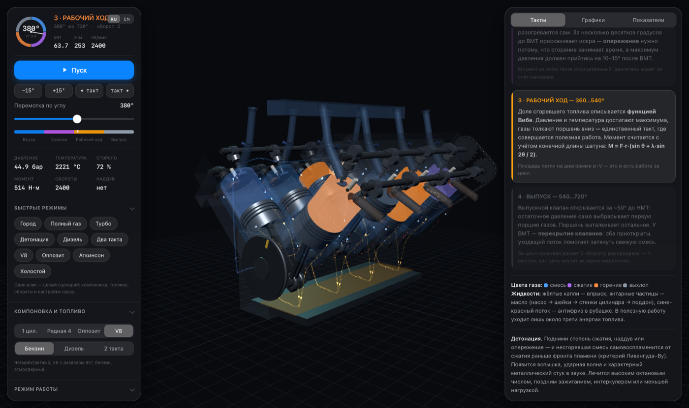

<sub>V8 с развалом 90°: восемь цилиндров, вспышки каждые 90°, суммарный момент почти без провалов</sub>

</div>

---

## 🎯 Что это

Учебный симулятор ДВС, в котором **ничего не нарисовано «на глаз»**. Положение поршня берётся
из точной кинематики, давление и температура — из численного интегрирования цикла с шагом 0,5°,
момент на валу — из разложения сил в шатуне, детонация — из критерия самовоспламенения
Ливенгуда–Ву, а звук выхлопа — из тех же моментов сгорания, что видны на экране.

Любой параметр меняется на ходу, и сразу видно, что произошло с диаграммой p–V, мощностью,
КПД и запасом до детонации.

Базовый двигатель: **86 × 86 мм, 0,5 л на цилиндр** — 0,5 л одноцилиндровый, 2,0 л рядная
четвёрка, 4,0 л V8.

## ✨ Что умеет

| | |
|---|---|
| 🔧 **Три компоновки** | Одноцилиндровый, рядная 4 с порядком работы 1–3–4–2, V8 с развалом 90° и крестообразным валом |
| 🔄 **Два и четыре такта** | Четырёхтактный с распредвалами или двухтактный с окнами в стенке цилиндра и кривошипно-камерной продувкой |
| ⛽ **Бензин и дизель** | Искровое зажигание или воспламенение от сжатия с двойной функцией Вибе |
| 🌀 **Наддув** | Турбина с инерцией ротора и вестгейтом, интеркулер, честная турбояма |
| 🎵 **Синтез звука** | Выхлопные импульсы, впуск, посвист компрессора, цокот клапанов и металлический стук детонации |
| 📈 **Семь графиков** | p–V, момент, кинематика, фазы ГРМ, энергобаланс, внешняя характеристика, уравновешенность |
| 💥 **Детонация** | По интегралу Ливенгуда–Ву — с ударной волной в камере и слышимым стуком |
| 🎚 **Настройка на ходу** | Обороты, дроссель, степень сжатия, опережение, октановое число, длина впускного тракта |
| 💧 **Все жидкости** | Топливо, выхлоп, масляный контур, антифриз в рубашке, поток наддува, петлевая продувка |
| ⚡ **Быстрые режимы** | Восемь сценариев одним кликом: Город, Полный газ, Турбо, Детонация, Дизель, Два такта, V8, Холостой |

<div align="center">
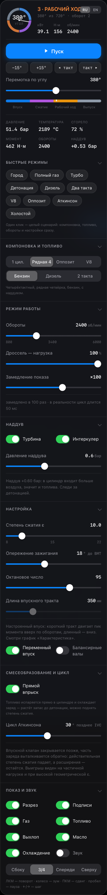
</div>

## 🎛 Пульт

Интерфейс сделан как пульт испытательного стенда: круговой указатель угла коленвала
с секторами тактов, живые показания мощности и момента в шапке, свёрнутые секции,
приборная линейка внизу.

Быстрые режимы задают целый сценарий — компоновку, топливо, обороты и настройки сразу,
чтобы не собирать интересный режим вручную.

Управление: ЛКМ — поворот камеры, колесо — зум, ПКМ — сдвиг, пробел — пауза,
стрелки — шаг по циклу (с Shift — по 45°).

<br clear="right">

## 🔄 Четыре такта

| | |
|---|---|
| 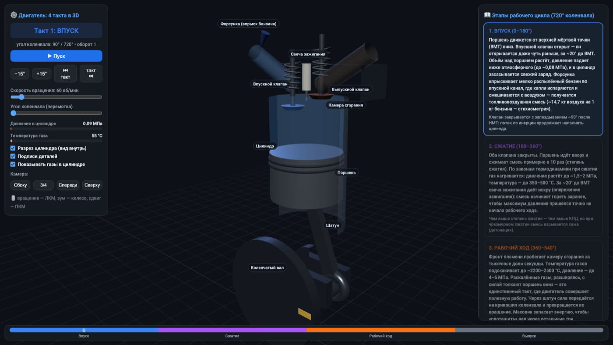 | **1 · Впуск (0…180°).** Поршень идёт вниз, впускной клапан открыт с опережением 20° до ВМТ. Давление падает до 0,9 бар, форсунка впрыскивает топливо. Сколько заряда реально влезло, показывает коэффициент наполнения — он зависит от оборотов, дросселя и настройки впускного тракта. |
| 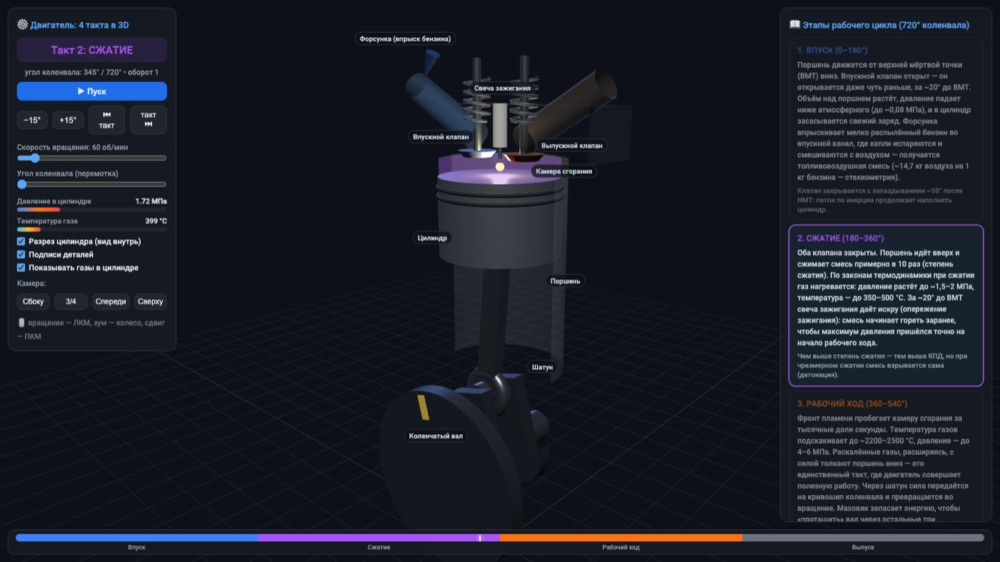 | **2 · Сжатие (180…360°).** Клапаны закрыты, смесь сжимается в ε раз, газ разогревается сам: к 340° уже 14,5 бар и 450 °C. За 18° до ВМТ проскакивает искра — сгорание занимает время, а максимум давления должен прийтись на 10–15° после ВМТ. |
| 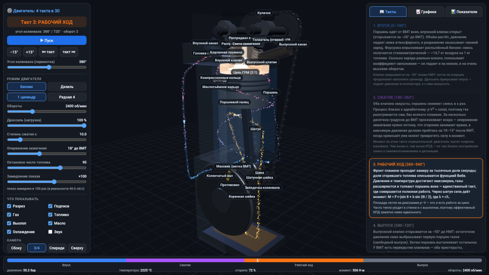 | **3 · Рабочий ход (360…540°).** Доля сгоревшего топлива описывается функцией Вибе; давление доходит до 51 бар, температура — до 2444 °C. Единственный такт, где совершается полезная работа. |
| 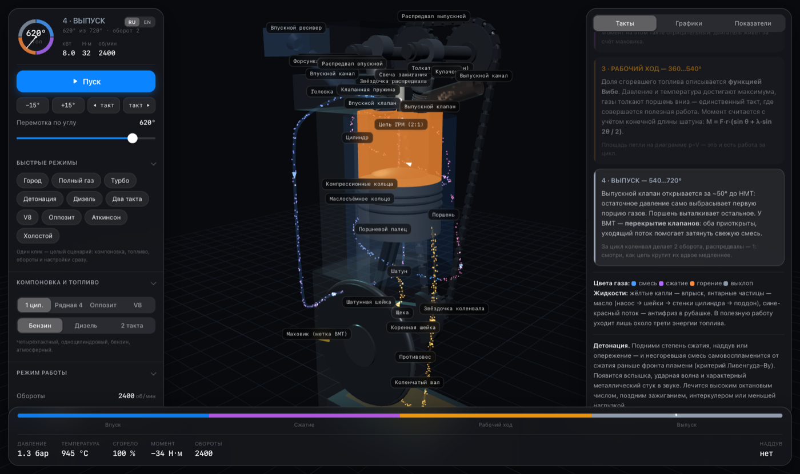 | **4 · Выпуск (540…720°).** Выпускной клапан открывается за 50° до НМТ — остаточные 5 бар сами выбрасывают первую порцию газов. У ВМТ наступает перекрытие клапанов. |

Момент на валу считается точно, с учётом конечной длины шатуна:

```
M = F·r·( sin θ + λ·sin 2θ / (2·√(1 − λ²·sin²θ)) ),   λ = r/L ≈ 0,3
```

## 🌀 Наддув

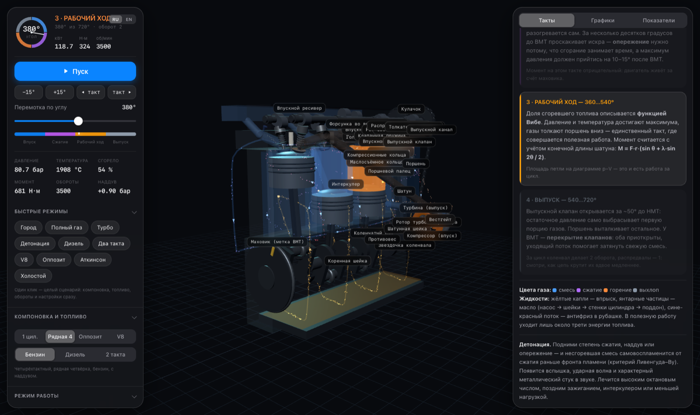

Выхлопные газы раскручивают турбину, компрессор нагнетает воздух, интеркулер его охлаждает —
всё это видно в 3D и всё влияет на расчёт:

| Режим | Мощность | Температура заряда | Детонация |
|---|---|---|---|
| Атмосферный | 49,0 кВт | 300 K | нет (0,58) |
| Наддув 0,8 бар **с интеркулером** | **87,4 кВт** (×1,79) | 325 K | на грани |
| Наддув 0,8 бар **без интеркулера** | 68,8 кВт (×1,41) | 376 K | раньше и сильнее |

Интеркулер здесь не украшение: он снимает 50 градусов с заряда, и именно поэтому позволяет
держать больший наддув без детонации.

**Турбояма** смоделирована через инерцию ротора: при 1500 об/мин наддув выходит на 90 % полки
за 0,87 секунды — включи режим «Турбо» и смотри на приборы сразу после старта.

## 🎼 Настроенный впуск

Коэффициент наполнения считается не по подогнанной кривой, а через резонанс столба воздуха
во впускном тракте: `f = c/(4L)`. Поэтому длина патрубков реально двигает пик момента —
и патрубки в 3D меняют длину вместе с ползунком:

| Длина тракта | Пик момента |
|---|---|
| 200 мм | 138 Н·м при **5600 об/мин** |
| 400 мм | 179 Н·м при **3200 об/мин** |
| 700 мм | 159 Н·м при **1850 об/мин** |

Короткий тракт — верхи, длинный — низы. Ровно то, за что борются на впускных коллекторах
переменной длины.

## 🔩 Компоновки и уравновешенность

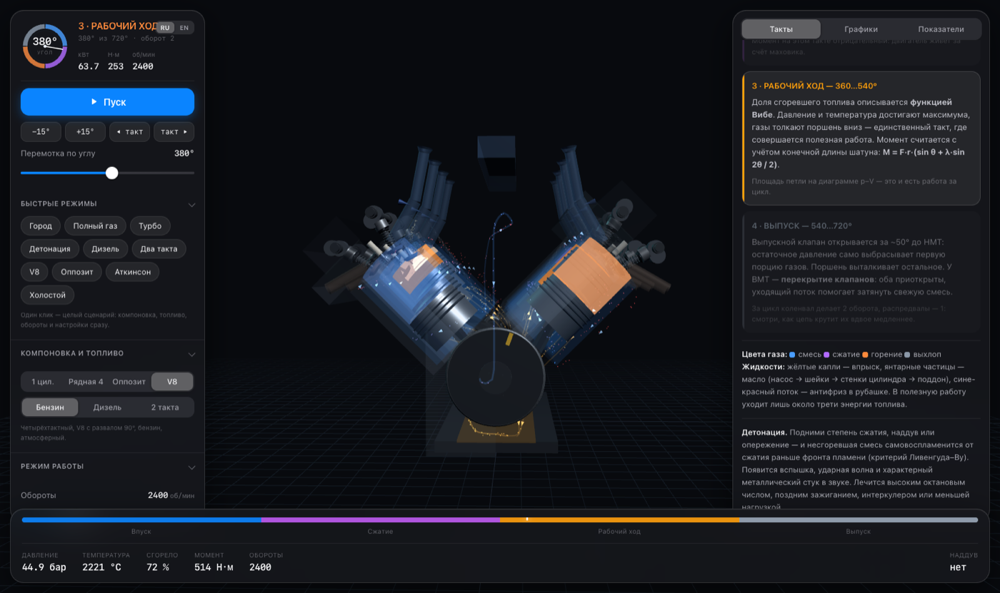

| Компоновка | 1-й порядок | 2-й порядок | Что это значит |
|---|---|---|---|
| Одноцилиндровый | **2334 Н** | 718 Н | Сила первого порядка ничем не скомпенсирована — отсюда характерная тряска |
| Рядная 4 | 0 Н | **2874 Н** | Первый порядок взаимно погашен, но вторые складываются — классическая вибрация I4 |
| V8, развал 90° | 0 Н | 0 Н | Оба порядка уравновешены, остаётся продольный момент и неравномерный выпуск — тот самый бурчащий звук |

Проверка модели: теория даёт `m·ω²·r = 2334 Н` для одного цилиндра и `4·λ·m·ω²·r = 2808 Н`
для второго порядка четвёрки — расчёт совпадает.

## ⚡ Двухтактный цикл

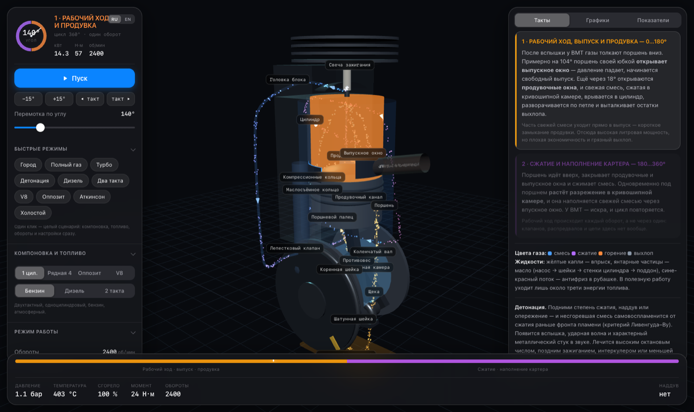

Ни клапанов, ни распредвалов, ни цепи: поршень своей юбкой открывает выпускное окно на 104°
и продувочные на 122°, а свежая смесь приходит из кривошипной камеры и разворачивается
по петле Шнюрле. Часть смеси уходит прямо в выпуск — это **короткое замыкание продувки**,
26 % в модели.

Отсюда честный компромисс (тот же объём, те же обороты):

| | Литровая мощность | КПД | Расход |
|---|---|---|---|
| Четыре такта | 23,7 кВт/л | 32,0 % | 256 г/(кВт·ч) |
| Два такта | **35,6 кВт/л** (×1,5) | **22,6 %** | 362 г/(кВт·ч) |

## 💥 Детонация

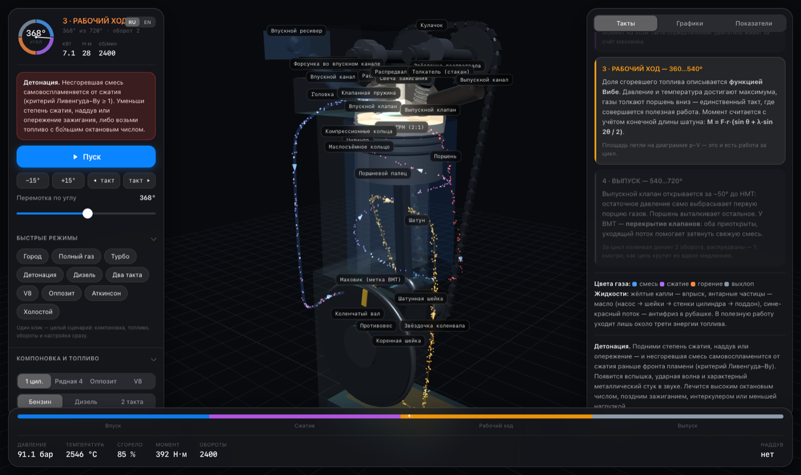

```
τ = 17,68 · (ON/100)^3,402 · p^(−1,7) · exp(3800/T),   детонация при ∫dt/τ ≥ 1
```

Интеграл берётся по несгоревшей части смеси, поэтому запас ведёт себя как в жизни:

| Режим | Интеграл | Детонация |
|---|---|---|
| ε = 8, 95-й, опережение 18° | 0,36 | нет |
| ε = 10, 95-й, опережение 18° | 0,61 | нет |
| ε = 12, 95-й, опережение 18° | 0,94 | нет, но на грани |
| ε = 10, **80-й**, опережение 18° | 1,10 | **есть** |
| ε = 12, 95-й, опережение 30° | 1,31 | **есть** |
| ε = 14, 92-й, опережение 35° | 2,19 | **есть, сильная** |
| ε = 12, опережение 30°, дроссель 30 % | 0,50 | нет — на частичной нагрузке безопасно |

Лечится тем же, чем в реальном моторе: высокооктановым топливом, поздним зажиганием,
интеркулером или меньшей нагрузкой. И слышно — характерным металлическим стуком.

## 📈 Графики

<table>
<tr>
<td width="50%">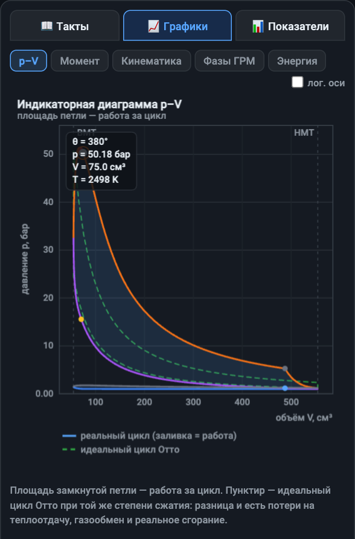</td>
<td width="50%">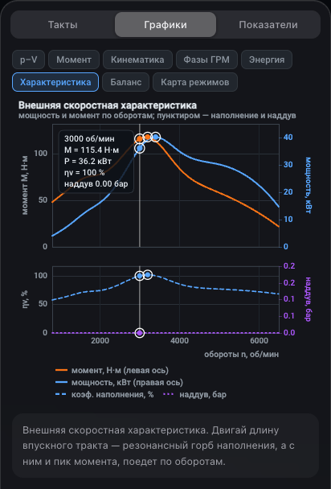</td>
</tr>
<tr>
<td><b>Индикаторная диаграмма p–V.</b> Площадь петли — работа за цикл, пунктир — идеальный
цикл при той же степени сжатия. При наддуве петля газообмена становится положительной,
и это подписано прямо на графике.</td>
<td><b>Внешняя характеристика.</b> Мощность и момент по оборотам плюс коэффициент наполнения
и наддув. Здесь и виден резонансный горб, который ездит вслед за длиной впускного тракта.</td>
</tr>
<tr>
<td>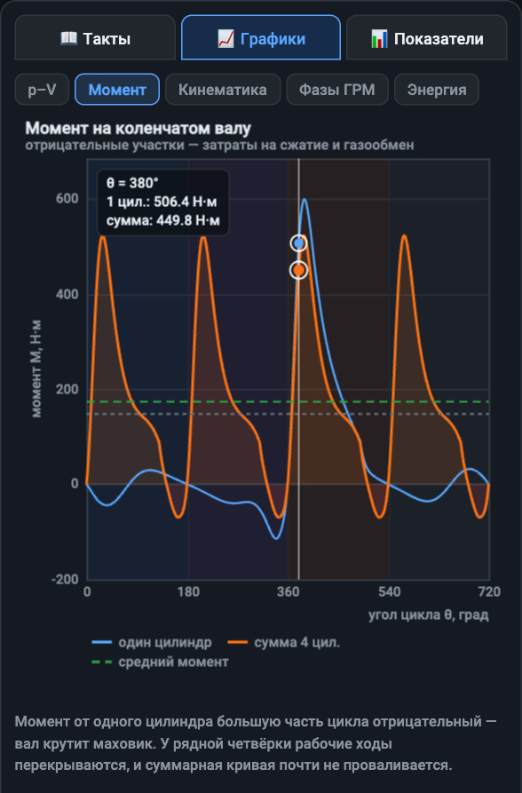</td>
<td>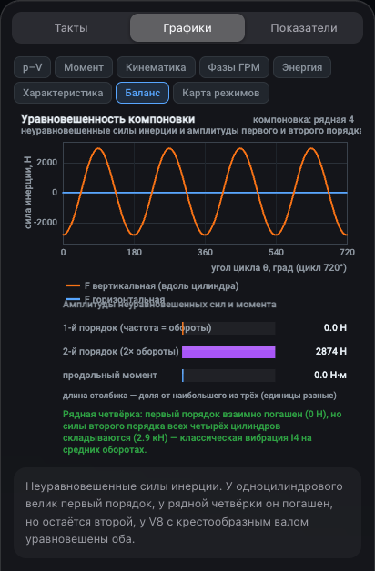</td>
</tr>
<tr>
<td><b>Момент на валу.</b> У одного цилиндра он большую часть цикла отрицательный — вал крутит
маховик. У многоцилиндрового рабочие ходы перекрываются, и провалы исчезают.</td>
<td><b>Уравновешенность.</b> Неуравновешенные силы инерции по углу и амплитуды первого
и второго порядка для текущей компоновки.</td>
</tr>
<tr>
<td>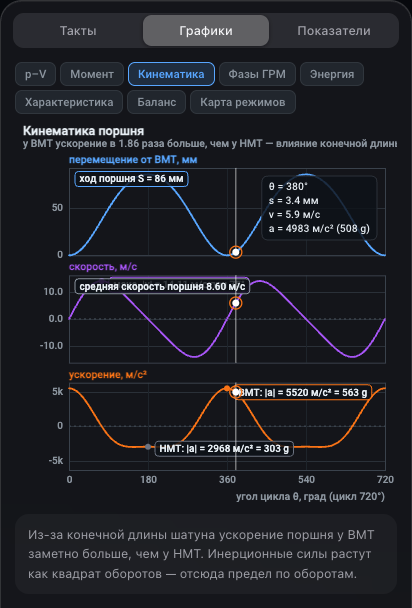</td>
<td>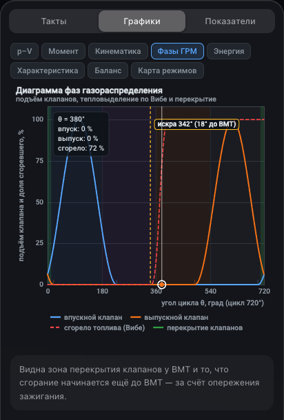</td>
</tr>
<tr>
<td><b>Кинематика поршня.</b> Ускорение у ВМТ <b>360 g</b> против <b>194 g</b> у НМТ — ровно
отношение (1+λ)/(1−λ). Инерционные силы растут как квадрат оборотов.</td>
<td><b>Фазы газораспределения.</b> Подъём клапанов (или открытие окон в двухтактном),
зона перекрытия и кривая тепловыделения Вибе.</td>
</tr>
</table>

<div align="center">
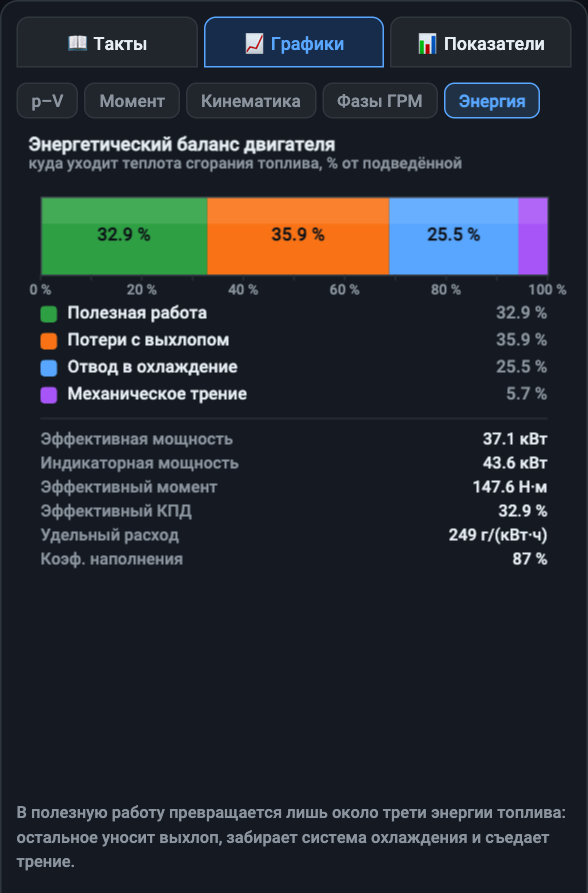
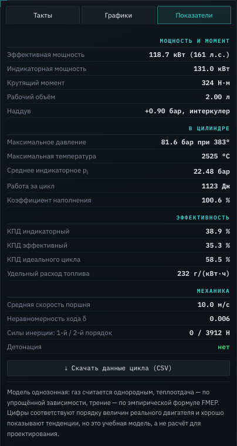
</div>

## 🧪 Что внутри модели

**Кинематика.** `y(θ) = r·cos θ + √(L² − (r·sin θ)²)`, r = 43 мм, L = 143 мм.

**Термодинамика.** Однозонная модель, интегрирование по углу 0,5° с четырьмя подшагами:

```
dT/dθ = [ dQ_сгор/dθ − dQ_стенки/dθ − p·dV/dθ ] / (m·cv),   p = m·R·T/V
```

- тепловыделение — функция Вибе, у дизеля двойная (быстрая premixed + длинная диффузионная);
- показатель адиабаты γ(T) от 1,40 до 1,255 — не константа;
- теплоотдача в стенки — корреляция Вошни, площадь растёт вместе с ходом поршня;
- выпуск — истечение `dp/dθ = −(p − p_вып)/τ − γ·p·dV/V`;
- остаточные газы сходятся за два прохода по циклу;
- трение — эмпирическая FMEP, отсюда разница индикаторной и эффективной мощности.

**Динамика.** Вращение интегрируется через момент инерции маховика:
`J·ω·dω/dθ = M(θ) − M_нагр`. При 1200 об/мин одноцилиндровый гуляет в диапазоне
984…1277 об/мин, четвёрка — 1199…1235.

**Звук.** Синтез на Web Audio: импульсы выхлопа через резонансный фильтр, шум впуска,
посвист компрессора, цокот клапанов, узкополосный стук детонации. Частота хлопков делится
на коэффициент замедления, поэтому на замедленном показе слышны отдельные вспышки,
синхронные с картинкой, а на ×1 складывается ровный рокот.

**Проверка.** Физическое ядро прогнано на 9600 конфигурациях без единого NaN; полный пересчёт
цикла занимает 1,2 мс, свип по оборотам — 90 мс. 3D-механизм проверен 392 утверждениями
(шатун точно на шейке для всех компоновок, распредвалы ровно 2:1, окна открываются юбкой
поршня), звук — измерениями частоты хлопков, отсутствия утечек узлов и клиппинга.

## 🎮 Параметры URL

```
?deg=380        стартовый угол коленвала
&layout=v8      компоновка: single | i4 | v8
&stroke=2       двухтактный цикл
&fuel=diesel    дизельный режим
&boost=0.9      наддув, бар
&turbo=1        турбина с инерцией (иначе наддув мгновенный)
&intercooler=0  выключить интеркулер
&intakeLen=700  длина впускного тракта, мм
&rpm=3500       обороты
&throttle=0.4   дроссель
&eps=12         степень сжатия
&adv=25         опережение зажигания
&octane=92      октановое число
&cam=side       камера: side | iso | front | top
&pause=1        открыть на паузе
&ui=0           скрыть панели, &still=1 — один кадр
```

Примеры: [V8](https://grisha123invent-official.github.io/piston-engine-3d-simulator/?layout=v8&deg=380&pause=1) ·
[турбо](https://grisha123invent-official.github.io/piston-engine-3d-simulator/?layout=i4&boost=0.9&turbo=1&eps=9&adv=12&octane=98&rpm=3500) ·
[два такта](https://grisha123invent-official.github.io/piston-engine-3d-simulator/?stroke=2&deg=140&pause=1) ·
[детонация](https://grisha123invent-official.github.io/piston-engine-3d-simulator/?eps=14&adv=35&octane=92&deg=368&pause=1) ·
[дизель](https://grisha123invent-official.github.io/piston-engine-3d-simulator/?fuel=diesel&eps=18&deg=372&pause=1)

## 🚀 Запуск локально

Сборка не нужна, но нужен HTTP-сервер — страница состоит из ES-модулей:

```bash
git clone https://github.com/grisha123invent-official/piston-engine-3d-simulator.git
```

```bash
cd piston-engine-3d-simulator && python3 -m http.server 8000
```

Открыть <http://localhost:8000>. Three.js подгружается с CDN.

## 📁 Структура

```
piston-engine-3d-simulator/
├── index.html          ← разметка и стили пульта
├── src/
│   ├── physics.js      ← термодинамика, наддув, резонанс, детонация, силы, балансировка
│   ├── engine3d.js     ← механизм: поршни, коленвал, распредвалы, турбина, окна двухтактного
│   ├── fluids3d.js     ← газы, впрыск, выхлоп, масло, охлаждение, наддув, продувка
│   ├── charts.js       ← семь графиков на canvas
│   ├── sound.js        ← синтез звука двигателя на Web Audio
│   ├── layout.js       ← компоновки и общие размеры сцены
│   ├── i18n.js         ← переключение языка (русский / английский)
│   ├── content.js      ← тексты теории и подсказок на двух языках
│   └── main.js         ← сцена, цикл анимации, интерфейс
└── docs/               ← скриншоты для этого README
```

## 💡 Что можно добавить дальше

- [ ] Карта режимов: мощность и расход по оборотам и нагрузке
- [ ] Впускной коллектор переменной длины, переключаемый автоматически
- [ ] Оппозитная компоновка и балансирные валы
- [ ] Гибридная схема: цикл Аткинсона, отключение цилиндров
- [ ] Прямой впрыск бензина и его влияние на детонацию

## 📄 Лицензия

[MIT](LICENSE) — используйте свободно, в том числе на уроках физики.
